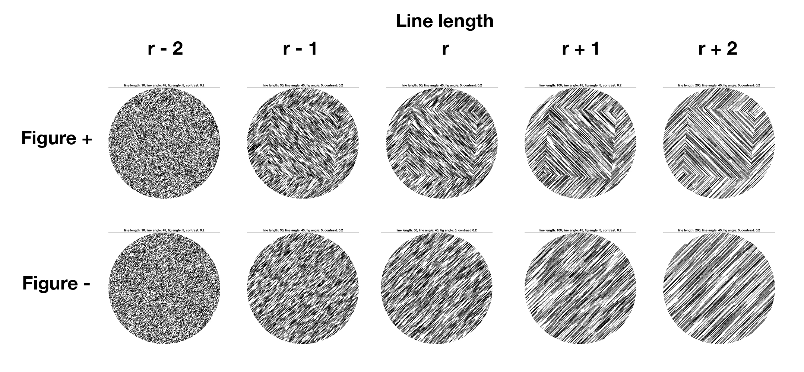
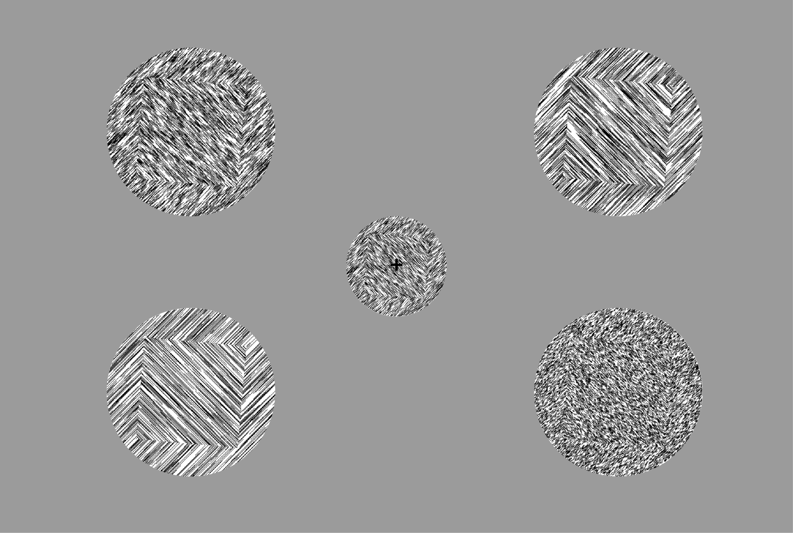
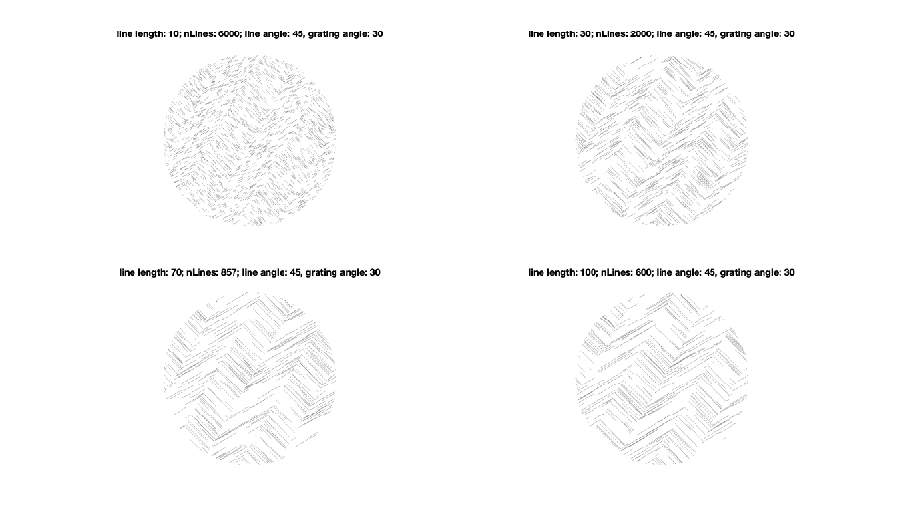

<h1>twcf-expt1: subjective inflation</h1>

Generating texture-defined figure ground stimuli. Figure strength is parametrically controlled using texture line length (Nothdurft, 1985; Supèr et al., 2001).

Figures are generated in the `twcf_makeFGStim.m`, in which the following stimuli parameters can be manipulated. 
```matlab 
% ground 
pixelsPerDegree = 99; 
sizeIm = [600 1000]; % size of image 
lineLength = 100; % length of texture lines
lineWidth = 1; % width of texture lines
lineAngle = [45]; % angle (degrees) of texture lines, scalar or vector 
imContrast = .1; % proportion of image covered by line 

% figure 
figRad = 260; % figure aperture size
apertureType = 'square'; %  determines figure shape 
figGrating = 1; % logical for "grating" figure 

% grating params 
spatialFrequency = 0.5; 
tiltDegrees = 30;
phase = 0;
contrast = 1;
```
*** 

Sample stimuli 


Sample display


*** 

Sample stimuli (old version)


Sample grating stimuli (old version)
